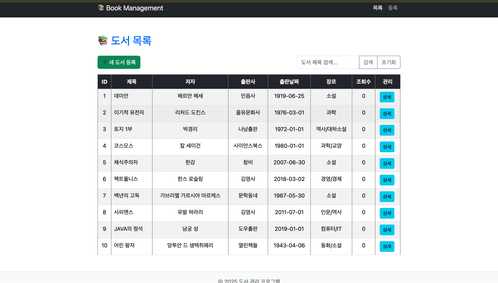
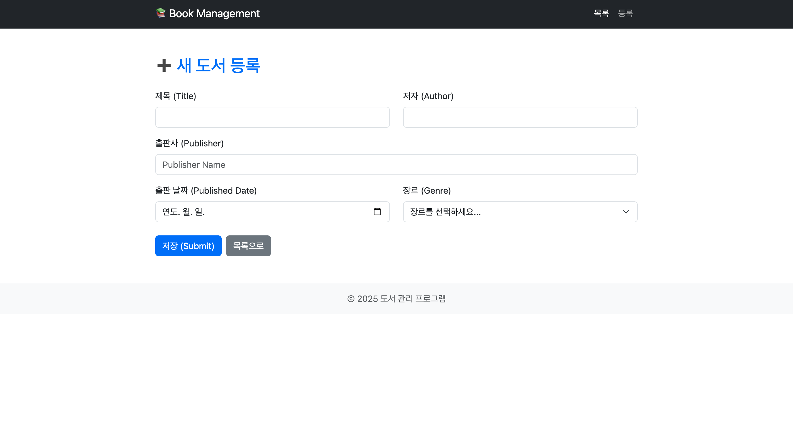
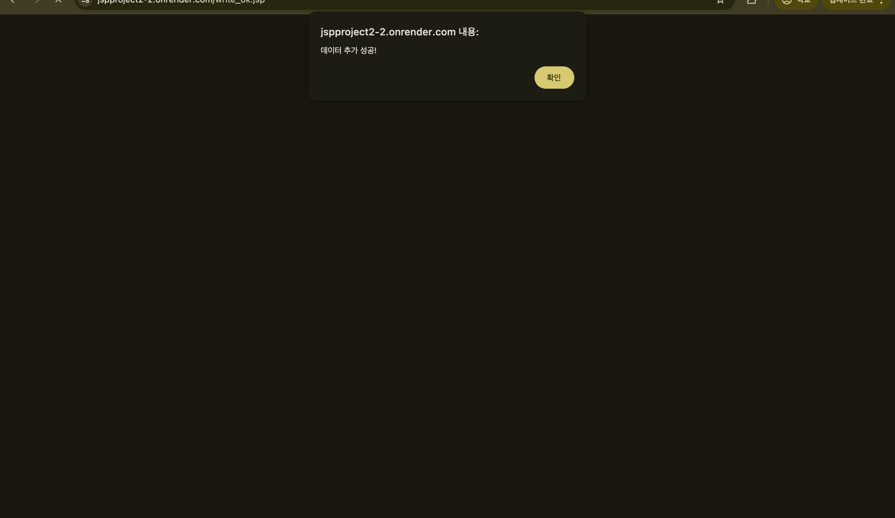
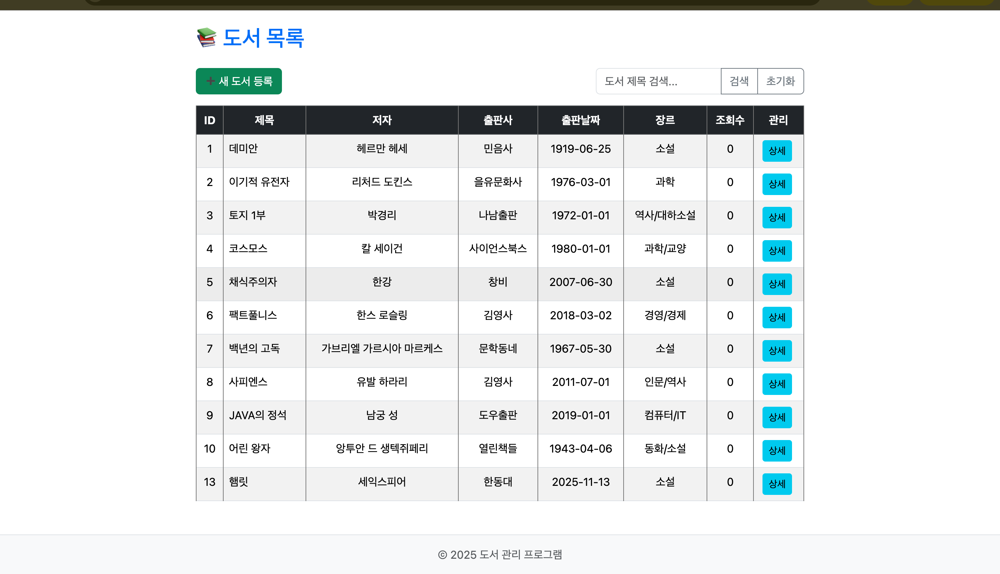
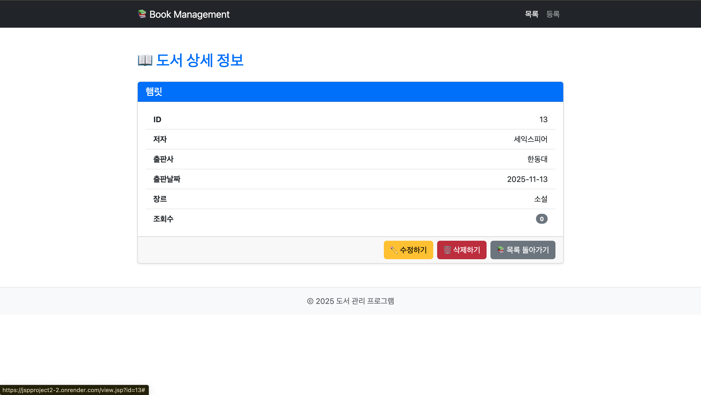
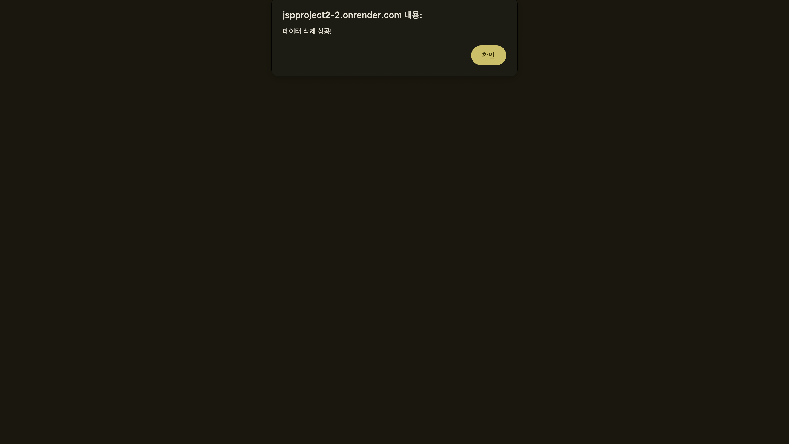
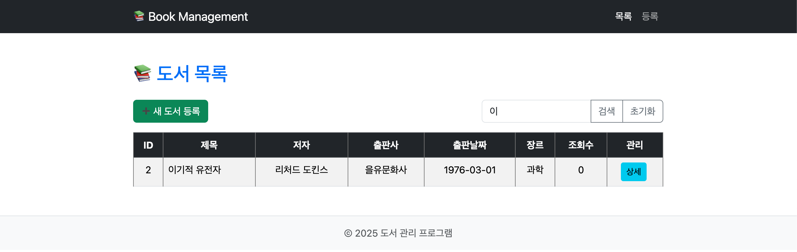

- 프로젝트 개요
    - 
    - JSP 프로젝트를 사용한 CRUD 프로그램
- 주요 기능 및 실행 방법
    -
    - CRUD 기능은 실제 데이터베이스에서 직접 관리
- 예시 실행화면 (캡처 필수)
    - 
    - 목록 (list.jsp)
    - 
    - 추가(write.jsp & write_ok.jsp)
    - 
    - 
    - 
    - 상세보기 (view.jsp)
    - 
    - 삭제 (delete_ok.jsp)
    - 
    - 검색 (list.jsp)
    - 
- 페이지 설명
    -
    - list.jsp 는 BookDAO에 loadBook이라는 함수로 테이블을 조회하고 검색한 키워드를 통해 원하는 데이터 정보만 불러올 수 있다.
    - write.html에서 받아온 필드 데이터들을 write_ok.jsp에서 처리해 추가해준다 
    - view.jsp id로 받아온 정보로 그 데이터만 상세하게 보여준다.
    - delete_ok.jsp id로 받아온 정보로 그 데이터만 삭제 시킨다. 
- 향후 개선 아이디어
    -
    - 하나의 테이블 데이터가 아닌 여러 테이블 데이터를 다룰 수 있는 프로그램을 만들 수 있다. 
    - 잘못된 입력 값을 관리 할 수 있도록 한다. 
